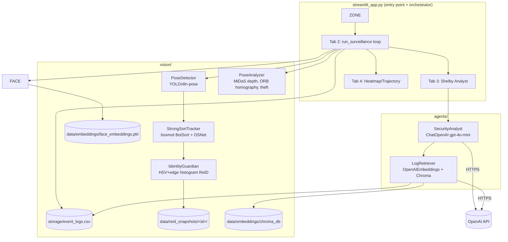
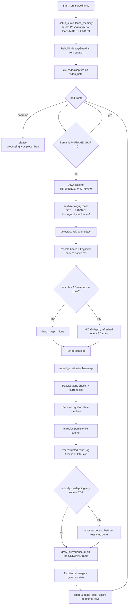
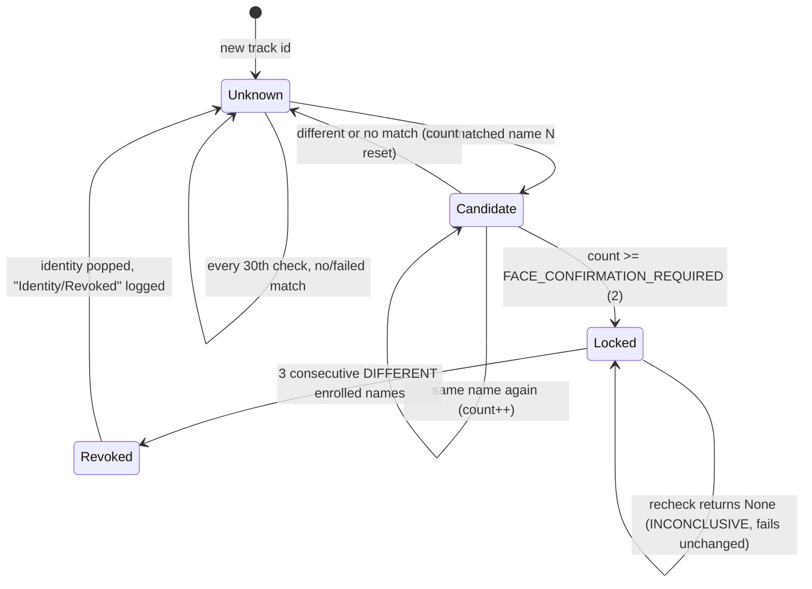
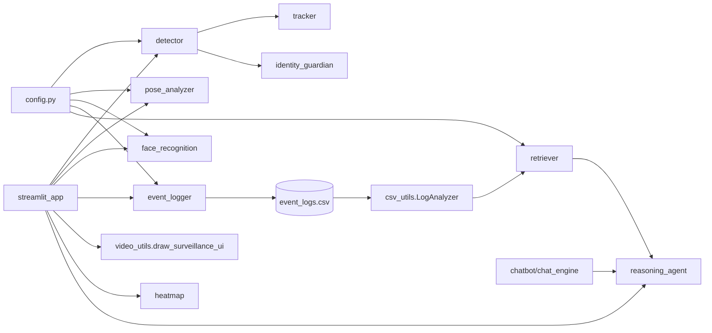

# Shelby — Intelligent Surveillance System

A single-machine, offline-video surveillance analysis system. It ingests an uploaded video file, detects and tracks people, identifies known faces, decides whether a person entered a user-drawn zone (using 2D geometry *and* monocular depth), detects object removal ("theft") from those zones, writes every decision to a CSV log, and then lets a RAG-backed LLM agent ("Shelby") answer natural-language questions about that log.

> **Scope note:** `app.py` is deliberately **not documented here** (excluded by request). It is a legacy OpenCV-window desktop variant of the same pipeline. `streamlit_app.py` is the maintained entry point. Where the two disagree, this document describes `streamlit_app.py`.

## Current CPU configuration (September 2026)

Run `venv311\Scripts\python.exe -m streamlit run streamlit_app.py` from the project root.
Set `USE_VLM = False` in `config.py` for no VLM client, worker, image buffering, or API requests;
set it to `True` for asynchronous activity recognition. Restart Streamlit after changing configuration.

CPU inference uses an FP32 ONNX export of the same YOLOv8n-pose weights when available.
After installing `requirements.txt`, run `venv311\Scripts\python.exe scripts/export_cpu_pose.py`
to generate it. The export and checksum manifest live in `data/models/`; missing or mismatched
exports fall back to PyTorch. Set `YOLO_CPU_BACKEND = "pytorch"` to force that fallback.
Neither backend moves processing to CUDA. The RTX 3060 is not used by these CPU changes.

The current defaults retain `FRAME_SKIP=2`, 640-width preprocessing, detection thresholds,
FP32 precision, and per-frame OSNet ReID. Preview refresh is capped separately at 10 FPS.
VLM completion has a three-second grace period and rejects late results from previous runs.
Heatmap retention is capped at 256 tracks and 18,000 points per track; old history is evicted.
Open the analyst or heatmap explicitly after surveillance to avoid eager background work.

See [CPU performance validation](docs/CPU_PERFORMANCE.md) for current measurements, model
selection, and live-camera limitations. The older measurements below describe earlier versions.

---

## Table of Contents


- [VLM Activity Recognition](#vlm-activity-recognition)
If your task is **chatbot / reporting** → 8, 9.

---

## What This System Actually Does

**Problem solved:** Given recorded CCTV-style footage, produce an auditable, queryable record of *who* was where, *whether* they were authorized, and *whether* a monitored object went missing — without a human watching the whole tape.

**Main use case (verified from the code):** a human uploads an `.mp4`/`.avi`/`.mov`, draws zones on the first frame in the browser, presses *Start Surveillance Engine*, watches an annotated preview, and afterwards chats with an LLM about what happened.

**It is not:**
- A live-camera / RTSP system. `cv2.VideoCapture` is always fed a file path from `data/uploaded_videos/`. (`vision/video_loader.py` accepts any `source`, but nothing calls it.)
- Multi-user or persistent across sessions. All in-run state is Streamlit `session_state` plus process memory. Only the CSV log, the face-embedding pickle, the ReID snapshot JPEGs, and the Chroma DB survive a restart.
- Authenticated. There is no login, authorization, or user model anywhere in the codebase.

**Two zone types drive everything:**

| Zone type | Shape drawn | Keypoints checked | Produces | Colour |
|---|---|---|---|---|
| `restricted` | rectangle | wrists (COCO 9, 10) | `Intrusion` / `Access` / `Theft` / `Removal` events | green→orange/red/blue |
| `passive` | polygon | ankles (COCO 15, 16) | *location context only* (the `Location` column) | yellow |

---

## Architecture



**Communication style:** everything is in-process Python method calls. There is no message bus, no queue, no background job, no scheduler, no webhook, no HTTP server of our own. The only network calls are: OpenAI (chat + embeddings), `torch.hub` (MiDaS download, first run only), Ultralytics weight download (only if a `.pt` is missing), and boxmot's OSNet weight download (first run only).

**The CSV is the seam.** The vision half only *writes* `storage/event_logs.csv`; the LLM half only *reads* it. They never share objects.

---

## Project Structure
├── streamlit_app.py          # ENTRY POINT. UI + the entire surveillance orchestration loop.
├── app.py                    # Legacy OpenCV-desktop variant. Excluded from this document.
│   ├── __init__.py           # Re-exports PoseDetector, PoseAnalyzer.
│   ├── detector.py           # PoseDetector: YOLO -> tracker -> IdentityGuardian -> Results.
│   ├── tracker.py            # StrongSortTracker: boxmot BotSort wrapper (name is historical).
│   ├── pose_analyzer.py      # MiDaS depth, KalmanSmoother, trespass check, ORB homography, theft.
│   ├── face_recognition.py   # FaceIdentifier: ArcFace enrolment + cosine matching.
│   ├── video_loader.py       # VideoLoader helper. UNUSED by streamlit_app.py.
│   ├── event_generator.py    # EMPTY FILE (0 bytes).
│   └── frame_processor.py    # EMPTY FILE (0 bytes).
│
├── storage/
│   ├── event_logger.py       # EventLogger: debounced CSV writer. Defines the 5-column schema.
│   ├── event_logs.csv        # The event log (committed to git; contains sample rows).
│   ├── video_metadata.csv    # EMPTY FILE, never read or written by any code.
│   └── __init__.py           # EMPTY.
│
├── agents/
│   ├── reasoning_agent.py    # SecurityAnalyst: prompt template + ChatOpenAI chain.
│   ├── retriever.py          # LogRetriever: CSV -> sentences -> Chroma vector store.
│   ├── report_generator.py   # EMPTY FILE (0 bytes).
│   └── __init__.py           # EMPTY.
│
├── chatbot/
│   ├── chat_engine.py        # SECONDARY ENTRY POINT: terminal REPL over SecurityAnalyst.
│   ├── memory.py             # EMPTY FILE (0 bytes).
│   ├── prompt_templates.py   # EMPTY FILE (0 bytes).
│   └── __init__.py           # EMPTY.
│
├── utils/
│   ├── csv_utils.py          # LogAnalyzer: CSV -> natural-language sentences for RAG.
│   ├── video_utils.py        # draw_surveillance_ui() (USED) + ZoneSelector (legacy, unused here).
│   ├── heatmap.py            # record_position / generate_heatmap / trajectory / legend.
│   ├── polygon_utils.py      # PolygonDrawer for the OpenCV desktop flow. Unused by Streamlit.
│   └── time.utils.py         # EMPTY FILE. Note the dot — not importable as a module anyway.
│
├── data/                     # All git-ignored except this tree shape.
│   ├── uploaded_videos/      # Videos saved by the sidebar uploader.
│   ├── authorized_faces/     # <Name>.jpg|jpeg|png -> enrolment source. Filename = identity.
│   ├── embeddings/
│   │   ├── face_embeddings.pkl   # {name: [512-float ArcFace vector]}
│   │   └── chroma_db/            # Chroma persistence dir; wiped and rebuilt on every ingest.
│   ├── reid_snapshots/<id>/  # snap_000.jpg ... written by IdentityGuardian.
│   ├── processed_frames/     # Present but nothing writes to it.
│   └── snapshots/            # Present but nothing writes to it.
│
├── yolov8n-pose.pt           # The model actually loaded (config.MODEL_PATH).
├── yolov8m-pose.pt           # Present, not referenced by any code.
├── yolov8l-pose.pt           # Present, not referenced by any code.
├── yolov8n.pt                # Present, not referenced by any code.
├── venv311/                  # Python 3.11.9 venv — the working one (boxmot needs 3.11/3.12).
└── venv/                     # Python 3.13.7 venv — cannot run boxmot.
```

**There are no test files, no Dockerfile, no CI config, no build config, no migrations, and no deployment configuration in this repository.**

---

## Execution Flow

### A. Startup

`streamlit run streamlit_app.py` executes the module top-to-bottom, and the `if __name__ == "__main__":` block at [streamlit_app.py:857](streamlit_app.py#L857) runs on **every** Streamlit rerun (i.e. on every widget interaction).

1. `st.set_page_config(...)` — page title/layout.
2. `configure_logging()` — `logging.basicConfig(level=DEBUG, force=True)`. **DEBUG level globally**, which makes ultralytics/torch/httpx very chatty on stdout.
3. If `'initialized' not in st.session_state` (first run only):
   - `initialize_surveillance_components()`:
     - `st.session_state.detector = PoseDetector()` → loads `yolov8n-pose.pt`, constructs `StrongSortTracker` (which imports and instantiates `boxmot.BotSort`, downloading `osnet_x0_25_msmt17.pt` on first use), constructs `IdentityGuardian` rooted at `config.REID_SNAPSHOT_ROOT`.
     - `st.session_state.logger = EventLogger()` → creates `storage/event_logs.csv` with headers if missing/empty.
     - `st.session_state.face_recognizer = FaceIdentifier()` → loads `face_embeddings.pkl`, or scans `data/authorized_faces/` and builds+pickles embeddings with DeepFace/ArcFace.
   - Seeds `video_path=None`, `zones=[]`, `identity_map={}`, `processing_complete=False`, `track_positions={}`.
4. `main()` → sidebar uploader, then four tabs.

> **MiDaS is *not* loaded at startup.** `PoseAnalyzer` (and therefore `torch.hub.load("intel-isl/MiDaS", ...)`) is constructed inside `setup_surveillance_memory()`, which runs at the beginning of **every** `run_surveillance()` call.

### B. Upload → zone definition

`handle_video_upload()` writes the uploaded bytes to `config.VIDEO_DIR/<original filename>`, then reads frame 0 into `session_state.first_frame` (**RGB**) and `session_state.frame_shape`.

`define_zones_ui()` renders `st_canvas` at a fixed `display_width = 800`; `scale_factor = orig_w / 800` converts canvas coordinates back to native video pixels. On form submit each fabric object becomes a zone dict:

- `type == "rect"` → `restricted` zone with `coords`, `orig_coords`, a grayscale + `GaussianBlur((5,5))` **`reference_patch`** cropped from frame 0, `missing_counter=0`, `last_interactor=None`.
- `type == "path"` → `passive` zone with a `polygon` built from the `M`/`L` path segments, and a placeholder `coords=(0,0,0,0)`.

### C. The surveillance loop (the core)



**Per-frame detail, in code order ([streamlit_app.py:246-614](streamlit_app.py#L246-L614)):**

1. **Frame skip** — `frame_id % FRAME_SKIP != 0` → `continue`. With `FRAME_SKIP = 2`, only even frame ids are processed.
2. **Downscale** — inference happens on a 640-px-wide copy; drawing happens on the full-resolution frame. After inference, `results.boxes.data` and `results.keypoints.data` are `.clone()`d and divided by `scale` so *every downstream consumer works in native pixel space*. The `clone()` is required because YOLO returns InferenceMode tensors that reject in-place writes.
3. **`align_zones`** — ORB (1000 features) matches the current frame against the grayscale frame 0; if >10 matches, `cv2.findHomography(..., RANSAC, 5.0)` warps `orig_coords` / `orig_polygon` into the current view. This runs on **every processed frame** and is a significant CPU cost.
4. **`track_and_detect`** — see [PoseDetector](#posedetector-visiondetectorpy).
5. **Conditional depth** — MiDaS runs only if at least one person bbox 2D-overlaps a zone, and only every `DEPTH_REFRESH_INTERVAL = 5` frames; otherwise the previous `last_depth_map` is reused. If no one is near a zone, `depth_map` stays `None` and `check_trespassing` degenerates to a pure 2D test (`z_min, z_max = -1, 2` accepts any normalized depth).
6. **Zone status reset** — every restricted zone is reset to `SECURE`/green at the top of each frame, so zone status is per-frame, not sticky.
7. **Per-person loop** (only when `results.boxes.id is not None`):
   - `record_position(...)` appends `(cx, cy, frame_id)` — **box centre**, not the foot point (see [Known Limitations](#known-limitations--unclear-areas)).
   - **Location:** if `check_trespassing` on passive zones is true, the ankle midpoint is tested against each polygon with `pointPolygonTest`; the first hit becomes `current_loc`. Otherwise `current_loc = "General Area"`.
   - **Face state machine** (below).
   - **Intrusion persistence:** `raw_is_tres = check_trespassing(all restricted zones)`. Consecutive true frames increment `intrusion_persistence[id]`; any false frame resets it to 0. `confirmed_tres = counter >= PERSISTENCE_THRESHOLD (5)`.
   - **Per-zone attribution:** for each restricted zone individually, if that zone is trespassed **and** `confirmed_tres`, set `z["last_interactor"] = display_name` and emit either `Access/AUTHORIZED` (if face-identified) or `Intrusion/UNAUTHORIZED`.
8. **Theft** — runs only when `anybody_overlapping_2d` is False for the whole frame (i.e. nobody's bbox intersects any restricted zone). `detect_theft` compares current vs reference edge density; if it fires, attribution depends on whether `z["last_interactor"]` is a value in `identity_map` → `Removal/BY_<name>` else `Theft/STOLEN`.
9. **Render** — `draw_surveillance_ui` mutates `frame` in place: zone rectangles/polygons with status text, person boxes, labels, COCO skeleton edges (drawn only where both endpoint confidences > 0.5), white joint dots.
10. **Throttled display** — `st.image` is only called every `1 / min(native_fps/FRAME_SKIP, 30)` seconds. Skipping a render never skips analysis.
11. **`logger.update_logs()`** — expires debounce keys older than 3 s so a recurring condition can be logged again.

### D. Face-recognition state machine



Key detail: `unknown_check_counters[id]` increments once per processed frame per track and is the modulus source for **both** the unknown-path (`% 30`) and the locked-path (`% 20`) checks. A `None` recheck result is treated as inconclusive **on purpose** — only a confident match to a *different* enrolled identity counts as a failure ([streamlit_app.py:390-404](streamlit_app.py#L390-L404)).

### E. Analyst / RAG flow

```mermaid
sequenceDiagram
    participant U as User
    participant ST as streamlit_app
    participant SA as SecurityAnalyst
    participant LR as LogRetriever
    participant LA as LogAnalyzer
    participant CH as Chroma
    participant OAI as OpenAI

    U->>ST: opens "Shelby Analyst" tab (needs processing_complete)
    ST->>SA: SecurityAnalyst()
    SA->>LR: LogRetriever(); ingest_logs()
    LR->>LA: get_all_logs_formatted()
    LA-->>LR: list of English sentences (one per CSV row)
    LR->>LR: shutil.rmtree(chroma_db)  # full wipe
    LR->>OAI: embed all documents (text-embedding-3-small)
    LR->>CH: Chroma.from_documents(persist_directory=...)
    U->>ST: question
    ST->>SA: consult(prompt)
    SA->>LR: query_relevant_logs(query, k=15)
    LR->>CH: similarity_search
    CH-->>SA: 15 Documents
    SA->>OAI: PromptTemplate | ChatOpenAI(gpt-4o-mini, temp=0.4)
    OAI-->>SA: response
    SA-->>U: response.content
```

`LogAnalyzer.get_all_logs_formatted()` is the *only* chunking strategy: **one CSV row = one document = one embedding**. There is no text splitter, no chunk size, and no overlap. It also carries state-transition logic (`Sitting → Walking` becomes "got up and moved") for an `Action == "Behavior"` row type that **nothing in `streamlit_app.py` currently writes**.

---

## Component Reference

### `PoseDetector` ([vision/detector.py](vision/detector.py))

| | |
|---|---|
| **Responsibility** | Single per-frame call producing an Ultralytics `Results` object with corrected, stable track IDs. |
| **Input** | BGR numpy frame (any resolution). |
| **Output** | `Results` with `.boxes` rebuilt as `[x1,y1,x2,y2,id,conf,cls]`, and `.keypoints` preserved. |
| **Side effects** | Writes ReID snapshot JPEGs via `IdentityGuardian` (if enabled). |
| **Depends on** | `config.MODEL_PATH`, `config.CONFIDENCE_THRESHOLD`, `config.IDENTITY_GUARDIAN_ENABLED`, `StrongSortTracker`, `IdentityGuardian`. |

Steps: YOLO (`classes=[0]`, person only) → `tracker.update()` → **empty-frame guard** (if result is empty, clock advances but tracking is skipped) → `guardian.update()` (if `config.IDENTITY_GUARDIAN_ENABLED=True`) → **ephemeral IDs reassigned via monotonic counter** so unmatched detections get unique negative IDs `-(idx+1)` never reused within a frame, barring negative IDs from all state dicts → `Boxes` tensor rebuilt. Negative track IDs do not accumulate intrusion persistence, face identity, trajectory, or zone attribution — they are drawn and evaluated for the current frame only.

**Phase 1 hardening changes (CLAUDE.md):**
- **Ephemeral ID collision fix (VF-9, VF-21):** Unmatched detections now get unique negative IDs via a monotonic counter instead of `-(idx+1)` which would collide (all position-0 detections became `-1`). Measured: colliding detections **244→0, 155→0, 33→0** across three clips. Negative IDs are now guarded against accumulating state.
- **Empty-frame freeze fix (VF-23, VF-24):** Added guard `if result.boxes is None or len(result.boxes) == 0: return result` to advance `guardian` state even when detection returns empty, because tracker state must advance even during occlusion. Call site in `detector.py`; `tracker.py` has a separate identical guard.

### `StrongSortTracker` ([vision/tracker.py](vision/tracker.py))

The class name is historical — it wraps **`boxmot.trackers.botsort.botsort.BotSort`** (installed: boxmot 18.0.0). BotSort = ByteTrack motion matching + OSNet appearance ReID + Kalman.

- `update(xyxy, confidences, frame, keypoints=None)` → `np.ndarray` of per-detection track IDs, `-1` where unmatched. `keypoints` is accepted and immediately `del`eted — API compatibility only.
- boxmot is fed `[x1,y1,x2,y2,conf,cls]` with `cls` forced to 0.
- **Empty-frame guard (Phase 1 VF-23, VF-24):** Fallback guard here also advances clock so lost tracks decay even during gaps, preventing frozen-clock artefacts.
- `_tracker_update` tries three call signatures (`(dets, frame)`, `dets=/img=`, `dets=/im=`) in order — defensive coding against boxmot API drift.
- `_assign_tracks_to_detections` does **greedy IoU** matching between boxmot's returned track boxes and the original detection order, because the caller needs IDs aligned to YOLO's box order. Threshold: `config.TRACKER_MATCH_IOU_THRESHOLD` (default `0.2`).

### `IdentityGuardian` ([vision/identity_guardian.py](vision/identity_guardian.py))

**Phase 1 status: DISABLED BY DEFAULT** — gated behind `config.IDENTITY_GUARDIAN_ENABLED` (default `False`). Class and all logic remain fully intact; bypassed in detector if flag is False.

When enabled, sits *after* BotSort and reverts ID switches. When a track ID appears that was not present in the previous frame, its appearance embedding is compared against the mean embedding of every known-but-currently-absent ID; if cosine similarity > `REID_SIMILARITY_THRESHOLD`, the new ID is permanently remapped to the old one via `self._id_map`. 

**Phase 1 measurement (VF-6, VF-12):** Guardian was over-merging visibly different people (bright yellow hoodie merged with dark jackets; 5 distinct people merged into 1 identity). Disabling it does not affect **tracking** quality (VF-11) — only **attribution**. Verified: with Guardian ON/OFF, track-lifetime distributions are byte-identical across all test clips.

Embedding (all thresholds hardcoded in this file, **not** in `config.py`):

```
crop -> resize 64x128
  hair   = HSV rows 0..15    (top 12%)  -> 16-bin H + 8-bin S, L2-normalised
  upper  = HSV rows 15..64   (12-50%)   -> 16-bin H + 8-bin S, L2-normalised
  lower  = HSV rows 64..128  (50-100%)  -> 16-bin H + 8-bin S, L2-normalised
  edges  = Canny(gray, 40, 120), summed over 8 horizontal bands (RAW pixel counts)
concat -> L2-normalise -> 80-dim float32 unit vector
```

Note the edge band counts are raw sums concatenated with normalized histograms *before* the final normalization, so the edge component's magnitude scales with crop content and can dominate the vector. That is what the code does; no rationale for it is recorded in the repo.

`get_stats()` returns `{known_identities, active_remaps, retired_ids}` and is displayed live in the Streamlit status panel.

### `PoseAnalyzer` ([vision/pose_analyzer.py](vision/pose_analyzer.py))

| Method | Does |
|---|---|
| `__init__(reference_frame)` | Stores grayscale frame 0, computes ORB reference keypoints, **loads MiDaS via lazy singleton** (thread-safe, keyed by model type + device; subsequent runs reuse model). Requires internet on first ever run; cached in `~/.cache/torch/hub`. Phase 1 VF-32: second in-process run reduced load from 3.34s → 0.015s (223x speedup). |
| `get_depth_map(frame)` | MiDaS forward pass → bicubic upsample → **min-max normalized per-frame to 0..1** (relative depth, *not* metric). |
| `check_trespassing(kpts, bbox, zones, depth_map, person_id)` | Intrusion decision: returns `True` on first keypoint inside zone in 2D *and* inside zone's depth band. |
| `check_2d_overlap(bbox, zones)` | Pure rectangle-intersection test on `z['coords']`. MiDaS gate and theft gate. |
| `align_zones(frame, zones)` | **Phase 1: GATED AND DISABLED BY DEFAULT** — controlled by `config.ZONE_ALIGN_ENABLED` (default `False`) and `config.ZONE_ALIGN_INTERVAL` (default `15`). When enabled: ORB→BFMatcher(Hamming, crossCheck)→RANSAC homography rewrites `z['coords']`/`z['polygon']`. Measured cost (VF-34): 47.6 ms/call (33% of frame budget). Phase 1 VF-41 end-to-end speed-up: alignment OFF raised throughput from 7.2 fps to ~10.6 fps on target clip. **Known bug (VF-37, OQ-17):** fails silently on crowd footage by matching moving people instead of camera motion, throwing zones thousands of px off-screen with zero failure warnings. Dormant only because alignment now OFF by default. Must be fixed before re-enabling (needs homography sanity check). |
| `detect_theft(frame, zone)` | Grid edge-density comparison. Mutates `zone['missing_counter']`. |

**Depth band construction** (per zone, per frame): `raw_obj_z = median(zone_roi)` smoothed by a per-zone `KalmanSmoother(Q=0.001, R=0.1)`; `structural_spread = (p85 - p15) / 2`; band = `object_z ± (config.DEPTH_TOLERANCE + structural_spread)`. Each candidate keypoint's depth is smoothed by its own `KalmanSmoother(Q=0.005, R=0.3)` keyed `f"{person_id}_{zone_type}_{kp_index}"`. **These filter dicts are never pruned**, so they grow with the number of distinct track IDs seen.

**Theft algorithm** (`detect_theft`):
1. Skip zones smaller than 15×15 px.
2. Current patch → gray → `GaussianBlur((3,3))` → `Canny(70, 200)`. Reference patch (blurred `(5,5)` at zone-creation time) → resized to current size → same Canny.
3. Split into `GRID_SIZE × GRID_SIZE` = 8×8 = 64 cells. Cells whose *reference* edge count ≤ 10 are ignored (too featureless to judge).
4. A cell "shows loss" if `(ref - curr) / ref * 100 > THEFT_THRESHOLD (35%)`.
5. `>= 2` cells showing loss (hardcoded at [pose_analyzer.py:238](vision/pose_analyzer.py#L238)) increments `zone['missing_counter']`; anything less resets it to 0.
6. Returns `missing_counter > THEFT_FRAME_PERSISTENCE (37)`.

### `FaceIdentifier` ([vision/face_recognition.py](vision/face_recognition.py))

- **Enrolment:** at construction, loads `data/embeddings/face_embeddings.pkl` if present; otherwise iterates `data/authorized_faces/*.{png,jpg,jpeg}`, calls `DeepFace.represent(model_name="ArcFace", enforce_detection=True)`, and keys the vector by **the filename stem** (`Talha.jpeg` → `"Talha"`). Then pickles the dict.
- **`extract_face_crop(frame, keypoints)`:** uses COCO keypoints 0–4 (nose, eyes, ears) with confidence > 0.5; requires **at least 3** valid points; expands the bbox by 50% horizontally and 60% vertically; rejects crops smaller than 20×20. Returns a BGR crop or `None`.
- **`identify_person(face_crop)`:** `DeepFace.represent(..., enforce_detection=False, detector_backend="skip")` (the crop is already a face — this is the main speed optimisation), then manual **cosine distance** `1 - cos(a,b)` against every enrolled vector. Returns the nearest name if `min_dist < FACE_MATCH_THRESHOLD (0.50)`, else `None`. **Every exception is swallowed and returns `None`** — an empty crop, a DeepFace failure, and a genuine non-match are indistinguishable to the caller.

### `EventLogger` ([storage/event_logger.py](storage/event_logger.py))

Debounced CSV appender. Schema: `Timestamp, Entity, Action, Status, Location`.

- `log_event(entity_id, event_type, status, is_active, location)`: builds `event_key = f"{entity}_{type}_{location}"`. **If `is_active` is False the method does nothing at all** (no write, no key removal) — the `is_active=False` calls in the theft `else` branch are no-ops. If active and the key is not currently in `active_events`, it writes a row; either way it refreshes the key's timestamp.
- `update_logs()`: drops keys idle for more than `cooldown_seconds = 3.0`, which is what allows the *same* event to be logged again later.
- `_write_to_csv_and_terminal(...)`: prints a human-readable line **and** appends the CSV row. Note `streamlit_app.py` calls this private method directly for `Identity` events, bypassing the debounce entirely.

### `LogAnalyzer` ([utils/csv_utils.py](utils/csv_utils.py))

CSV → text. `load_data()` always returns a DataFrame with the 5 required columns (empty on missing file or read error, and it back-fills a missing `Location` column with `"General Area"`). `get_all_logs_formatted()` is what RAG ingests. `get_recent_logs_as_text(limit=20)` and `get_statistics()` exist and are correct but **are never called by any code in the repo**.

### `SecurityAnalyst` / `LogRetriever` ([agents/](agents/))

See [AI / ML Components](#ai--ml-components).

### `draw_surveillance_ui` ([utils/video_utils.py:134](utils/video_utils.py#L134))

Mutates the frame in place. Reads `z['color']` and `z['status']` set by the loop, and colours a person's box `COLOR_AUTHORIZED` (blue) when their track id is in `identity_map`. Also in this file: `ZoneSelector`, the OpenCV-window zone drawer used by the legacy desktop flow — unused by `streamlit_app.py` but still imported transitively (it pulls in `utils/polygon_utils.py`).

### Heatmap utilities ([utils/heatmap.py](utils/heatmap.py))

Pure functions, no Streamlit imports, independently testable. `record_position` accumulates `(cx, cy, frame_id)`; `generate_heatmap` builds a float accumulator, Gaussian-blurs it (`sigma`), normalizes to 0–255, applies `COLORMAP_JET`, and alpha-blends only where `heat > 2`. `generate_trajectory` draws an HSV hue-120→0 gradient polyline with arrows every 10 points and START/END markers. `generate_combined` layers trajectory over heatmap.

---

## AI / ML Components

| # | Model | Where loaded | Version / identifier | Purpose |
|---|---|---|---|---|
| 1 | **YOLOv8n-pose** | [vision/detector.py:26](vision/detector.py#L26) | `yolov8n-pose.pt` (local file, 6.8 MB); ultralytics 8.4.41 | Person detection + 17 COCO keypoints |
| 2 | **BotSort + OSNet** | [vision/tracker.py:78](vision/tracker.py#L78) | boxmot 18.0.0, `osnet_x0_25_msmt17.pt` (auto-downloaded) | Multi-object tracking with appearance ReID |
| 3 | **IdentityGuardian** | [vision/identity_guardian.py](vision/identity_guardian.py) | hand-written, not a neural net | Colour/edge-histogram ReID to undo ID switches |
| 4 | **MiDaS_small** | [vision/pose_analyzer.py:41](vision/pose_analyzer.py#L41) | `torch.hub.load("intel-isl/MiDaS", "MiDaS_small")` | Monocular relative depth for the 3D voxel intrusion test |
| 5 | **ArcFace** (DeepFace) | [vision/face_recognition.py](vision/face_recognition.py) | deepface 0.0.99 on tensorflow 2.15 / tf-keras | Face identification against enrolled photos |
| 6 | **text-embedding-3-small** | [agents/retriever.py:12](agents/retriever.py#L12) | OpenAI, via `langchain_openai.OpenAIEmbeddings` | Log-sentence embeddings for retrieval |
| 7 | **gpt-4o-mini** | [agents/reasoning_agent.py:17](agents/reasoning_agent.py#L17) | OpenAI, via `langchain_openai.ChatOpenAI`, `temperature=0.4` | Natural-language forensic answers |
| 8 | **gpt-4o-mini** (vision) | [vision/vlm_activity_analyzer.py](vision/vlm_activity_analyzer.py) | OpenAI, via `OpenAI()` client with vision API | Human activity recognition for tracked people |

### Input / output contracts

- **MiDaS →** float32 `(H, W)` array **normalized per frame to 0..1**. Because normalization is per-frame, depth values are **not comparable across frames** — this is why the Kalman smoothers and the percentile-based `structural_spread` exist.
- **ArcFace →** 512-float list from `DeepFace.represent(...)[0]["embedding"]`. Compared with cosine *distance*; lower = more similar.
- **OpenAI embeddings →** consumed only by Chroma; never inspected by our code.
- **LLM →** `response.content` string, rendered directly with `st.markdown`. The prompt explicitly forbids markdown formatting characters, so the model is asked to return plain prose.

### The prompt

The entire prompt lives inline in [agents/reasoning_agent.py:26-75](agents/reasoning_agent.py#L26-L75) as a `PromptTemplate` with variables `context`, `question`, `current_time`. It encodes substantial business logic that exists **nowhere else in the codebase**, including:

- Retroactive authorization ("if a person takes an object while unidentified but is recognized later, treat the earlier action as authorized").
- Vocabulary rules (never say "asset", never say "laptop zone", say "Entered" instead of "Intrusion").
- Small-object vs. large-zone phrasing, 12-hour time conversion, social-chit-chat handling, off-topic refusal.

**Changing detection semantics without updating this prompt will produce answers that contradict the logs.** There is no memory: `SecurityAnalyst.consult()` sends only the retrieved context and the current question; `chatbot/memory.py` is empty and the Streamlit chat history was explicitly removed ([streamlit_app.py:870](streamlit_app.py#L870)).

### Retrieval parameters

| Parameter | Value | Location |
|---|---|---|
| Documents per query (`k`) | **15** | [reasoning_agent.py:82](agents/reasoning_agent.py#L82) (overrides the `k=5` default in `query_relevant_logs`) |
| Chunking | 1 CSV row → 1 document | [csv_utils.py:102](utils/csv_utils.py#L102) |
| Chunk overlap | none | n/a |
| Similarity metric | Chroma default (L2 on the default HNSW index) | not configured anywhere |
| Index lifecycle | `shutil.rmtree` + full rebuild on **every** `SecurityAnalyst()` construction | [retriever.py:41-52](agents/retriever.py#L41-L52) |

---

## Configuration Reference

### `config.py` — paths

| Name | Value | Controls | Safe to change? |
|---|---|---|---|
| `BASE_DIR` | dir of `config.py` | Root for every derived path | No — derived |
| `VIDEO_DIR` | `data/uploaded_videos` | Where the uploader saves videos | Yes |
| `LOG_PATH` | `storage/event_logs.csv` | The event log. Read by `LogAnalyzer`, written by `EventLogger`, existence-checked by the UI | Yes, but 3 modules follow it |
| `FACE_DIR` | `data/authorized_faces` | Enrolment photo folder; **filename stem = identity name** | Yes |
| `EMBEDDINGS_PATH` | `data/embeddings/face_embeddings.pkl` | Cached ArcFace vectors. **Delete this file to force re-enrolment** | Yes |
| `REID_SNAPSHOT_ROOT` | `data/reid_snapshots` | Guardian snapshot JPEGs | Yes |
| `VECTOR_DB_PATH` | `data/embeddings/chroma_db` | Chroma persistence dir; wiped on each ingest | Yes |

### `config.py` — detection & tracking (Phase 1 hardening)

| Name | Value | File used in | What it controls | Effect of change |
|---|---|---|---|---|
| `MODEL_PATH` | `"yolov8n-pose.pt"` | [detector.py:26](vision/detector.py#L26) | Which YOLO pose model loads. **Relative path** → resolved against process CWD | `yolov8m-pose.pt` / `yolov8l-pose.pt` present; would improve keypoint quality at FPS cost. Ultralytics downloads unknown names. |
| `CONFIDENCE_THRESHOLD` | `0.45` | [detector.py:47](vision/detector.py#L47) | YOLO person-detection confidence floor | Lower → more distant/occluded people, more false tracks. Higher → people drop out, breaking tracks. **Aligned with `TRACKER_NEW_TRACK_THRESH=0.45`** (Phase 1) to close confidence dead band (VF-19). |
| `TRACKER_MAX_AGE` | `1200` (Phase 1 exposed) | [tracker.py:__init__](vision/tracker.py#L78-L95) | **INERT for removal** — governs `max_obs` only. Does NOT govern track removal (that's `track_buffer`). Comment records this so it won't be re-tuned. | Changing it has no measurable effect on tracking (VF-2). Kept exposed for visibility only. |
| `TRACKER_TRACK_BUFFER` | `30` (Phase 1 exposed) | [tracker.py:__init__](vision/tracker.py#L78-L95) | **The actual removal lever.** Unmatched detections kept this many updates before discarding. | Removal boundary at 30→31 transitions (VF-1, OQ-10). |
| `TRACKER_NEW_TRACK_THRESH` | `0.45` (Phase 1 changed from 0.6) | [tracker.py:__init__](vision/tracker.py#L78-L95) | Minimum confidence to spawn a new track. **Closes dead band from above.** | **Must stay aligned with `CONFIDENCE_THRESHOLD`** or band reopens (VF-19). Halves ephemeral detections, passes VF-13 regression (6 identities). |
| `TRACKER_MATCH_IOU_THRESHOLD` | `0.2` (Phase 1 exposed) | [tracker.py:_assign_tracks_to_detections](vision/tracker.py#L110-L130) | Greedy IoU matching boxmot tracks to YOLO detections. | Measurement (VF-8): 0% of unmatched detections fail this threshold; all are starved (boxmot fewer boxes). Exposed for visibility. |
| `IDENTITY_GUARDIAN_ENABLED` | `False` (Phase 1 default) | [detector.py:53-54](vision/detector.py#L53-L54) | Enable/disable appearance-based ID-switch correction | Guardian was over-merging (VF-6, VF-12). Disabled by default Phase 1. Does not affect tracking (VF-11), only attribution. |
| `SKELETON_EDGES` | 12 COCO pairs | [video_utils.py:175](utils/video_utils.py#L175) | Skeleton drawing only | Cosmetic |
| `MIN_KEYPOINT_CONFIDENCE` | `0.40` | [pose_analyzer.py:128](vision/pose_analyzer.py#L128) | Minimum keypoint confidence to *use a joint for intrusion test* | Lower → hallucinated joints trigger intrusions. Higher → misses with partial occlusion. |

Detection-related hardcoded values not in `config.py`:

| Value | Location | Meaning |
|---|---|---|
| `classes=[0]` | [detector.py:49](vision/detector.py#L49) | Person class only; no object detection anywhere in the system |
| `conf > 0.5` (face kps) | [face_recognition.py:75](vision/face_recognition.py#L75) | Face-keypoint confidence floor |
| `conf > 0.5` (skeleton) | [video_utils.py:177](utils/video_utils.py#L177) | Draw-only |
| `>= 3` valid face points | [face_recognition.py:79](vision/face_recognition.py#L79) | Minimum face landmarks before a crop is attempted |
| pad `0.5×w`, `0.6×h` | [face_recognition.py:90-91](vision/face_recognition.py#L90-L91) | Face crop expansion beyond the eyes/nose hull |
| min crop `20×20` | [face_recognition.py:98](vision/face_recognition.py#L98) | Rejects tiny faces |

### `vision/tracker.py` — BotSort parameters (Phase 1 hardening: all four tracker knobs exposed)

| Param | Value | Passed to BotSort as | Notes |
|---|---|---|---|
| `max_age` | **configurable via `config.TRACKER_MAX_AGE`** (default `1200`, exposed Phase 1) | `max_age` | **Inert for removal: does not govern track removal.** Governs `max_obs = max_age + 5` only. Track removal is actually governed by `track_buffer` (VF-1, VF-2). Comment records this so future maintainers do not re-try tuning it. |
| `track_buffer` | **configurable via `config.TRACKER_TRACK_BUFFER`** (default `30`, exposed Phase 1) | **internal to boxmot** | **The actual removal lever** — unmatched detections kept alive for this many updates, then discarded. Removal boundary at 30→31 transitions (VF-1, OQ-10 ruled). |
| `new_track_thresh` | **configurable via `config.TRACKER_NEW_TRACK_THRESH`** (default `0.45`, changed Phase 1) | `det_thresh` in `BotSort.__init__` but re-set here | **Closes confidence dead band from above (Mode B, VF-19).** Was 0.6, now 0.45 = `CONFIDENCE_THRESHOLD`. **Must stay aligned** or band reopens. Measured: halved ephemeral detections, passes VF-13 regression (6 identities, split at 430-448). |
| `n_init` | `1` | `min_hits` | A track is confirmed on first detection → fast but noisy. |
| `max_iou_distance` | `0.9` | `iou_threshold` | Very permissive association. |
| `max_cosine_distance` | `0.55` | **nothing** | Accepted by `__init__` and never used. |
| `nn_budget` | `150` | **nothing** | Accepted by `__init__` and never used. |
| `det_thresh` | `0.3` | `det_thresh` | Hardcoded in boxmot call, below `CONFIDENCE_THRESHOLD`, never binds. |
| `max_obs` | `max_age + 5` | `max_obs` | boxmot requires `> max_age`. |
| `TRACKER_MATCH_IOU_THRESHOLD` | **configurable via `config.TRACKER_MATCH_IOU_THRESHOLD`** (default `0.2`, exposed Phase 1) | greedy re-association | Minimum IoU to bind boxmot track box to YOLO detection. Measurement (VF-8): 0% of unmatched detections failed due to this; all were starved (boxmot returned fewer boxes). Exposed for visibility, not a working lever. |
| `TRACKER_REID_WEIGHTS` / `STRONGSORT_REID_WEIGHTS` | absent → `osnet_x0_25_msmt17.pt` | ReID backbone | Add either key to `config.py` to override. |
| `TRACKER_DEVICE` / `STRONGSORT_DEVICE` | absent → `cuda:0` if available else `cpu` | ReID device | |
| `TRACKER_FP16` / `STRONGSORT_FP16` | absent → `torch.cuda.is_available()` | half precision | |

### `vision/identity_guardian.py` — module-level constants (**not** in `config.py`, Guardian disabled Phase 1)

| Name | Value | Controls | Effect of change |
|---|---|---|---|
| `MIN_CROP_H` / `MIN_CROP_W` | `60` / `25` px | Minimum person crop to build embedding | Raise → distant people never enrolled. Lower → noisy embeddings, wrong merges. |
| `FRAMES_MISSING_BEFORE_REID` | `1` | How long ID must be absent to become re-ID candidate | `1` = single-frame gap allows merge — aggressive. |
| `REID_SIMILARITY_THRESHOLD` | `0.82` | Cosine similarity floor to merge new ID into old | **Most consequential ReID knob when Guardian enabled.** Lower → different people merge (wrong attribution). Higher → same person gets multiple IDs. Measurement shows 0.82 was over-aggressive (VF-6, VF-12). |
| `MAX_FRAMES_MISSING` | `450` | Frames before identity retired | Effectively ~30 s at 15 fps. OSNet actually recovers within ~30 updates (~2 s); beyond that is unmeasured (OQ-7). |
| `MAX_SNAPSHOTS` | `8` | Rolling embeddings averaged per identity | More → stable mean, slower lighting adaptation. Note: overwritten file is `snap_008.jpg`, not `snap_007.jpg` (VF-10). |
| `MIN_FRAMES_TO_ENROLL` | `2` | Consecutive frames before embedding built | Guards half-visible first detections. |
| Canny `(40, 120)` | [identity_guardian.py:112](vision/identity_guardian.py#L112) | Silhouette edge extraction | |
| crop resize `(64, 128)` | [identity_guardian.py:92](vision/identity_guardian.py#L92) | Embedding input size | Invalidates in-process embeddings if changed. |
| region splits `12% / 50%` | [identity_guardian.py:99-108](vision/identity_guardian.py#L99-L108) | hair / shirt / trousers bands | |
| **Edge block bug (VF-5)** | **VERIFIED: 100% silhouette** | Pre-normalisation edge energy median/p10/p90 = 100.00%, colour never participates | Embedding is pure silhouette outline, not appearance. Fix deferred (Task 6a) because Guardian now disabled. Revisit only if OQ-6 forces Guardian back. |

The `REID_*` keys **in `config.py`** (`REID_SNAPSHOT_INTERVAL=25`, `REID_SNAPSHOT_MIN_COUNT=3`, `REID_EMBEDDING_MATCH_THRESHOLD=0.72`, `REID_EMBEDDING_FALLBACK_THRESHOLD=0.58`, `REID_EMBEDDING_DRIFT_THRESHOLD=0.48`, `REID_IDENTITY_MATCH_MARGIN=0.04`, `REID_MAX_EMBEDDINGS_PER_IDENTITY=30`, `REID_REASSIGN_GRACE_FRAMES=8`) are **read by nothing**. Only `REID_SNAPSHOT_ROOT` is used. Editing the others has no effect — the live equivalents are the module constants above.

### `config.py` — depth / intrusion / zone alignment (Phase 1: alignment gated and disabled)

| Name | Value | Controls | Effect of change |
|---|---|---|---|
| `DEPTH_MODEL_TYPE` | `"MiDaS_small"` | torch.hub model id | `"DPT_Hybrid"` / `"DPT_Large"` handled but far slower. |
| `DEPTH_TOLERANCE` | `0.10` | Base half-width of accepted depth band in normalized 0–1 units (per-frame) | Larger → hand further from object counts as touch → more intrusions. Smaller → misses. |
| `ZONE_ALIGN_ENABLED` | `False` (Phase 1 disabled) | Enable/disable ORB homography re-alignment | **Phase 1 gating (Task 3).** Was running every frame, costing 33% of frame budget (VF-34). Disabled by default. Known failure (VF-37, OQ-17): silently matches moving people on crowds, throwing zones off-screen. Must be fixed before re-enabling. |
| `ZONE_ALIGN_INTERVAL` | `15` (Phase 1 exposed) | Recompute homography every N frames when enabled | Only affects behavior when `ZONE_ALIGN_ENABLED=True`. Measured (VF-36): interval 15 captures most of disabled benefit. |
| `ZONE_ALIGN_NFEATURES` | `1000` (default, Phase 1 measured) | ORB feature budget | Measurement (VF-35): cost is O(n²) in features matching, plus ~21ms fixed floor (detection + grayscale). `ZONE_ALIGN_ENABLED=False` now moot, but logged for re-enabling path. |
| `DEPTH_SCORE_THRESHOLD` | `0.70` | **Unused** | No effect |
| `MAX_INTERACTION_SCALE` | `1.8` | **Unused** | No effect |
| `MIN_INTERACTION_SCALE` | `0.6` | **Unused** | No effect |
| Kalman zone filter | `Q=0.001, R=0.1` | [pose_analyzer.py:117](vision/pose_analyzer.py#L117) | Heavy smoothing of zone's depth (zones static) |
| Kalman person filter | `Q=0.005, R=0.3` | [pose_analyzer.py:145](vision/pose_analyzer.py#L145) | Lighter smoothing of wrist's depth |
| percentiles `15` / `85` | [pose_analyzer.py:111-112](vision/pose_analyzer.py#L111-L112) | `structural_spread` — widens band for depth-varied zones | |
| `z_min, z_max = -1, 2` | [pose_analyzer.py:123](vision/pose_analyzer.py#L123) | **Depth-disabled fallback**: accepts any depth, pure 2D test | This is why intrusions fire when MiDaS skipped. |
| ORB `nfeatures=1000` | [pose_analyzer.py:33](vision/pose_analyzer.py#L33) | Homography feature budget | |
| `len(matches) > 10` | [pose_analyzer.py:180](vision/pose_analyzer.py#L180) | Minimum matches before re-aligning zones | Below this, zones keep previous coordinates. |
| RANSAC reproj `5.0` | [pose_analyzer.py:185](vision/pose_analyzer.py#L185) | Homography outlier tolerance in px | |

### `config.py` — theft

| Name | Value | Controls | Effect of change |
|---|---|---|---|
| `THEFT_THRESHOLD` | `35.0` (**percent**) | Per-cell edge-density loss that marks a cell as "lost" | Lower → very sensitive (lighting change alone can trigger). Higher → only total object removal triggers. |
| `GRID_SIZE` | `8` | 8×8 = 64 cells per zone | Larger grid → finer cells → each cell noisier. |
| `THEFT_FRAME_PERSISTENCE` | `37` | Consecutive **processed** frames the loss must persist. Test is `> 37`, so 38 frames | At `FRAME_SKIP=2` on 30 fps footage ≈ 2.5 s of video. Lower → faster alerts, more false positives from shadows. |
| `cells_showing_loss >= 2` | [pose_analyzer.py:238](vision/pose_analyzer.py#L238) | How many of the 64 cells must show loss | Hardcoded. Very low — 2/64 cells. |
| `ref_density > 10` | [pose_analyzer.py:232](vision/pose_analyzer.py#L232) | Ignore featureless cells | |
| Canny `(70, 200)` | [pose_analyzer.py:217-218](vision/pose_analyzer.py#L217-L218) | Edge extraction for both current and reference patch | Must stay identical for both, or the comparison is meaningless. |
| zone min size `15×15` | [pose_analyzer.py:213](vision/pose_analyzer.py#L213) | Skip tiny zones | |
| blur `(5,5)` ref / `(3,3)` current | [streamlit_app.py:154](streamlit_app.py#L154), [pose_analyzer.py:215](vision/pose_analyzer.py#L215) | Denoising before Canny | The kernels intentionally differ; no rationale is recorded in the repo. |

### `config.py` — face recognition

| Name | Value | Controls | Effect of change |
|---|---|---|---|
| `FACE_MODEL` | `"ArcFace"` | DeepFace model for both enrolment and matching | Changing it **invalidates `face_embeddings.pkl`** — delete the pickle, and re-tune `FACE_MATCH_THRESHOLD` (each model has a different distance scale). |
| `FACE_MATCH_THRESHOLD` | `0.50` | Maximum **cosine distance** for a match | The inline comment says "0.40 is a strict threshold for ArcFace" while the value is 0.50 — the comment is stale relative to the value. Lower → fewer false identifications, more "unknown". Higher → strangers get matched to enrolled names, which flips intrusions into authorized accesses. |
| `FACE_CHECK_INTERVAL` | `30` | Run face recognition every 30th processed frame for an **unidentified** track | Lower → faster recognition, much higher CPU (DeepFace is the most expensive per-call component). |
| `FACE_REVALIDATE_INTERVAL` | `20` | Re-check an **already locked** identity every 20th processed frame | |
| `FACE_REVALIDATION_FAILS` | `3` | Consecutive *contradicting* matches before an identity is revoked | Only a confident match to a **different** enrolled name counts; `None` does not. |
| `FACE_CONFIRMATION_REQUIRED` | `2` | Consecutive identical matches before an identity is locked to a track | Raise to reduce mis-identification; costs `FACE_CHECK_INTERVAL × N` frames of latency. |

### `streamlit_app.py` — loop-local constants (hardcoded inside `run_surveillance`)

| Name | Value | Line | Controls | Notes |
|---|---|---|---|---|
| `FRAME_SKIP` | `2` | [230](streamlit_app.py#L230) | Process every 2nd frame | Measured (VF-38, VF-39): raising to 3 reaches real-time on only 1 of 3 test clips and degrades tracker refresh (15 Hz → 10 Hz) and track lifetimes. **RULED to stay at 2.** Shifting it changes real-time meaning of every frame-count threshold. At current 2, **end-to-end throughput is ~7.2 fps** (VF-31), below real-time for 30 fps camera. Phase 1 optimizations (alignment OFF, singleton MiDaS) raised to ~10.6 fps but still insufficient for live camera. |
| `INFERENCE_WIDTH` | `640` | [235](streamlit_app.py#L235) | Downscale width for YOLO | Detections are scaled back up; drawing and depth use the full frame. |
| `DEPTH_REFRESH_INTERVAL` | `5` | [240](streamlit_app.py#L240) | Recompute MiDaS every 5 processed frames when needed | Higher → cheaper but staler depth. |
| `PERSISTENCE_THRESHOLD` | `5` | [847](streamlit_app.py#L847) (`setup_surveillance_memory`) | Consecutive trespassing frames before intrusion *confirmed* | The intrusion false-positive dial. Phase 1: old VF-13 baseline of 5 was partially a freeze artefact; corrected to **6 after fixing empty-frame clock** (VF-25). **New rule: office cctv must resolve to 6 tracks, split at frames 430-448** (track 4 ends 429, track 6 starts 450). Old "5" was correct for the wrong reason — now we keep the corrected number (VF-13). |
| `target_display_interval` | `1 / min(native_fps/FRAME_SKIP, 30)` | [243](streamlit_app.py#L243) | Preview refresh cap | Display only; never affects analysis. |
| `CAP_PROP_BUFFERSIZE` | `2` | [225](streamlit_app.py#L225) | OpenCV capture buffer | Meaningful for live sources; near-inert for files. |
| `display_width` | `800` | [95](streamlit_app.py#L95) | Zone-drawing canvas width; sets `scale_factor` | Changing it changes the canvas→video coordinate mapping. |
| `cooldown_seconds` | `3.0` | [event_logger.py:13](storage/event_logger.py#L13) | Debounce window (**wall-clock seconds, not video time**) | Lower → repeated rows for one continuous event. Higher → long events logged once. |
| heatmap `sigma` | slider 5–80, default `35` | [696](streamlit_app.py#L696) | Heat blob radius (px) | UI-only |
| heatmap `alpha` | slider 0.1–0.9, default `0.55` | [701](streamlit_app.py#L701) | Overlay opacity | Combined view uses `0.45` internally |
| heat mask | `heat_uint8 > 2` | [heatmap.py:131](utils/heatmap.py#L131) | Only blend where there is heat | |
| `arrow_freq` | `10` | [heatmap.py:147](utils/heatmap.py#L147) | Trajectory arrow spacing | |

### LLM / RAG config

| Name | Value | Controls |
|---|---|---|
| `LLM_MODEL_NAME` | `"gpt-4o-mini"` | Chat model. Despite the `# Standard Google Embeddings` comment nearby, both models are **OpenAI**. |
| `EMBEDDING_MODEL_NAME` | `"text-embedding-3-small"` | Embedding model |
| `temperature` | `0.4` | [reasoning_agent.py:20](agents/reasoning_agent.py#L20) — hardcoded, not in config |
| `k` | `15` | [reasoning_agent.py:82](agents/reasoning_agent.py#L82) — hardcoded |

There is **no** configured retry limit, request timeout, token limit, rate limit, or cache duration anywhere in this project. All defaults come from the `openai` / `langchain` libraries.

---

## Environment Variables and Secrets

`config.py` calls `load_dotenv(override=True)` — values in `.env` **override** already-exported shell variables.

| Variable | Read at | Required? | Format | Behaviour if missing |
|---|---|---|---|---|
| `GOOGLE_API_KEY` | [config.py:63](config.py#L63) | **Required for the analyst tab**, despite the name | The value is used as an **OpenAI** key (`sk-...`) | `config.GOOGLE_API_KEY` and `config.OPENAI_API_KEY` become `None` → the analyst fails (see below) |
| `OPENAI_API_KEY` | not read by `config.py` | — | `sk-...` | Present in the repo's `.env`, but **`config.py` never reads it** |

```env
# .env  (git-ignored — never commit real values)
GOOGLE_API_KEY=YOUR_OPENAI_API_KEY   # yes: an OpenAI key, in a Google-named variable
```

### Verified defect: the analyst cannot authenticate as configured

`config.py` does:

```python
GOOGLE_API_KEY = os.getenv("GOOGLE_API_KEY")
OPENAI_API_KEY = GOOGLE_API_KEY
```

The checked-in `.env` sets only `OPENAI_API_KEY`, so `config.OPENAI_API_KEY` is `None`. Both `ChatOpenAI(openai_api_key=None)` and `OpenAIEmbeddings(openai_api_key=None)` receive an **explicit `None`**, which in `langchain-openai` 1.2.1 suppresses the `default_factory` that would otherwise read the `OPENAI_API_KEY` environment variable. Confirmed empirically in this repo's `venv311`:

```
ChatOpenAI(..., openai_api_key=None) -> openai_api_key resolved: False, client: None
invoke() -> openai.OpenAIError: The api_key client option must be set ...
```

**Fix (one line, in `.env`):** set `GOOGLE_API_KEY` to the OpenAI key. Alternatively change [config.py:63-64](config.py#L63-L64) to read `OPENAI_API_KEY`. Do not "fix" it by relying on the library env fallback — it is bypassed here.

### Hardcoded values that are good candidates for env vars

`LLM_MODEL_NAME`, `EMBEDDING_MODEL_NAME`, `temperature`, `MODEL_PATH`, `FRAME_SKIP`, `INFERENCE_WIDTH`, and the tracker device selection are all compile-time constants today. Nothing else in the codebase reads any environment variable.

---

## Data Storage

There is **no database server**. Four persistence mechanisms:

### 1. `storage/event_logs.csv` — the event log

| Column | Type | Values actually written by `streamlit_app.py` |
|---|---|---|
| `Timestamp` | `YYYY-MM-DD HH:MM:SS` | `datetime.now()` at write time — **wall-clock, not video time** |
| `Entity` | str | `Person_<track_id>`, a recognized name, or the literal `ASSET` |
| `Action` | str | `Intrusion`, `Access`, `Theft`, `Removal`, `Identity` |
| `Status` | str | `UNAUTHORIZED`, `AUTHORIZED`, `STOLEN`, `BY_<name>`, `Recognized as <name>`, `Revoked <name> (mismatch)` |
| `Location` | str | Zone name, or `General Area` |

`LogAnalyzer.get_all_logs_formatted()` additionally handles `Action == "Behavior"` with `Status` in `Walking / Sitting / Lying Down / Bending / Picking Up / Running` — a row type **no current code path writes** (it belonged to the deleted action recognizer). This is dormant, not dead: it will activate if behaviour logging is reintroduced.

Lifecycle: append-only, never rotated, never truncated by the app. The file is committed to git and contains sample rows dated 2026-07-15 / 2026-07-23.

### 2. `data/embeddings/face_embeddings.pkl` — enrolled identities

Python `pickle` of `{name: [512 floats]}`. Written once when absent; **never invalidated when photos change**. Adding a new person to `data/authorized_faces/` has no effect until this file is deleted.

### 3. `data/reid_snapshots/<track_id>/snap_NNN.jpg`

Written by `IdentityGuardian._save_snapshot` on each embedding update. Filename index = current embedding-bank length, so with `MAX_SNAPSHOTS = 8` the bank saturates and files `snap_007.jpg` are repeatedly overwritten. Purely diagnostic — **nothing reads these back**. They accumulate across runs and are never cleaned up.

### 4. `data/embeddings/chroma_db` — vector index

Chroma 1.5.8 persistent client. **Destroyed with `shutil.rmtree` and fully rebuilt every time `SecurityAnalyst()` is constructed**, which means every fresh Streamlit session that opens the analyst tab re-embeds the entire log against the OpenAI API. `_ensure_vector_store()` can re-open an existing directory, but `ingest_logs()` in `__init__` always runs first, so that path is only reachable if ingestion returned early (empty log).

---

## External Services

**OpenAI is the only external service in the project.**

| | |
|---|---|
| **Endpoints** | Chat Completions (`gpt-4o-mini`) and Embeddings (`text-embedding-3-small`), via `openai` 2.32.0 under `langchain-openai` 1.2.1 |
| **Auth** | Bearer API key, sourced from `config.OPENAI_API_KEY` ← `os.getenv("GOOGLE_API_KEY")` |
| **Called from** | [agents/reasoning_agent.py](agents/reasoning_agent.py) (chat) and [agents/retriever.py](agents/retriever.py) (embeddings) |
| **Request flow** | User question → Chroma similarity search (local) → 15 documents joined with `\n` → `PromptTemplate` → `ChatOpenAI` |
| **Failure handling** | `consult()` catches everything and returns `"Error consulting the OpenAI analyst: {e}"` as if it were an answer. The Streamlit layer separately special-cases `"429"` and `"insufficient_quota"` substrings — but those only surface for exceptions raised *outside* `consult`, since `consult` swallows its own. |
| **Retries / timeouts** | Library defaults only; nothing configured |
| **Hard dependency** | The Shelby Analyst tab is unusable without it. The vision pipeline is fully offline and unaffected. |

`langchain-google-genai` is installed and listed in `requirements.txt`, but **no module imports it** — a leftover from an earlier Gemini-based version (the `# <--- Changed from Google` comments in `agents/`).

First-run-only downloads (not runtime dependencies afterwards): `torch.hub` → MiDaS from GitHub; boxmot → OSNet weights; ultralytics → YOLO weights if the `.pt` is absent.

---

## Error Handling

| Site | Behaviour |
|---|---|
| `FaceIdentifier.load_embeddings` | Bad pickle → prints and regenerates. Per-photo `DeepFace.represent` failure → prints `- Could not process <file>` and skips that identity silently. |
| `FaceIdentifier.identify_person` | **Bare `except: return None`.** A crash, an empty crop, and an honest non-match are indistinguishable. This directly feeds the identity state machine, where `None` is treated as "inconclusive". |
| `StrongSortTracker.__init__` | `ImportError` → `RuntimeError` with a `pip install boxmot --upgrade` hint. `TypeError` on the full constructor → warns and retries with a minimal constructor (which silently drops `max_age`, `iou_threshold`, etc.). |
| `StrongSortTracker._tracker_update` | Tries 3 signatures; raises `RuntimeError` if all fail. |
| `IdentityGuardian._save_snapshot` | Swallows write failures at DEBUG level. |
| `LogAnalyzer.load_data` | Any read error → prints and returns an empty, correctly-shaped DataFrame. Downstream never sees the exception. |
| `LogRetriever.ingest_logs` | `rmtree` failure → warns and continues, which can leave a stale Chroma directory that `from_documents` then writes into. An empty log returns early, leaving `vector_store = None`; `query_relevant_logs` then prints and returns `[]`, and the LLM is asked to answer from `"No specific logs found for this query."` |
| `SecurityAnalyst.consult` | Catches all exceptions and **returns the error string as the answer**. |
| `streamlit_app.run_shelby_analyst` | `SecurityAnalyst()` construction is **outside** the try block — an auth or ingestion failure raises to Streamlit and renders a traceback. Only `consult()` is guarded. |
| `run_surveillance` | **No try/except anywhere in the loop.** Any exception (corrupt frame, CUDA OOM, keypoint index error) aborts the run, leaves `cap` unreleased, and never sets `processing_complete`. |
| Video upload | No validation beyond the uploader's `type=` filter; a file that OpenCV cannot open leaves `first_frame` unset, and the Zone Setup tab shows "Please upload a video first." |

**Fragile spots to be aware of:** the `check_trespassing` passive branch at [streamlit_app.py:346-347](streamlit_app.py#L346-L347) indexes `kpts.xy[0][15]` and `[16]` unguarded — it is only reached when `check_trespassing` already returned true (which required confident ankle keypoints), so it is safe today, but it depends on that ordering. `draw_surveillance_ui` assumes `results.keypoints[i]` exists for every box.

---

## Setup and Running

### Prerequisites

- **Python 3.11 or 3.12.** `boxmot` does not support 3.13 — the repo's `venv/` (3.13.7) cannot run the pipeline; `venv311/` (3.11.9) is the working environment.
- A CUDA GPU is optional. Without one, YOLO, MiDaS, OSNet, and ArcFace all fall back to CPU and the pipeline runs, slowly.
- Internet access on first run (model downloads) and whenever the analyst tab is used.
- `numpy==1.26.4` exactly — `requirements.txt` records that boxmot hard-requires it. TensorFlow 2.15 (pulled in by deepface/tf-keras) is also pinned to that numpy generation.

### Install

```bash
python -m venv venv311            # must be 3.11 or 3.12
venv311\Scripts\activate          # Windows
pip install -r requirements.txt
```

### Configure

```bash
# create .env in the project root
GOOGLE_API_KEY=YOUR_OPENAI_API_KEY
```

Then enrol faces: drop one clear photo per person into `data/authorized_faces/` named `<Identity>.jpg`. The filename stem becomes the name shown in the UI and written to the log. Delete `data/embeddings/face_embeddings.pkl` after any change to that folder.

`yolov8n-pose.pt` is already in the repo root. MiDaS and OSNet download themselves on first use.

### Run

```bash
streamlit run streamlit_app.py
```

**Run from the project root** — `config.MODEL_PATH` is the relative string `"yolov8n-pose.pt"`, resolved against the process working directory.

Then, in the browser: sidebar upload → **Zone Setup** (draw, name, *Confirm and Save Zones*) → **Surveillance Feed** → *🚀 Start Surveillance Engine* → wait for "Surveillance Processing Finished" → **Shelby Analyst** / **Heatmap & Trajectory**.

### Terminal-only analyst (no video processing)

```bash
python chatbot/chat_engine.py
```

A REPL over `SecurityAnalyst`, reading whatever is already in `storage/event_logs.csv`. It inserts the project root into `sys.path` itself, so it works from any directory. Type `exit`, `quit`, or `q` to leave.

### Not available in this repository

No test suite, no `pytest`/`unittest` files, no lint config, no `Dockerfile`, no `docker-compose.yml`, no CI workflow, no build step, no deployment manifest, and no npm/JS toolchain. Any command beyond the two above would be invented.

---

## How to Safely Modify This Project

### Safe, common modification points

| Goal | Change | Also check |
|---|---|---|
| Retune intrusion sensitivity | `PERSISTENCE_THRESHOLD` ([streamlit_app.py:847](streamlit_app.py#L847)), `config.MIN_KEYPOINT_CONFIDENCE`, `config.DEPTH_TOLERANCE` | Log volume; the debounce at `cooldown_seconds` |
| Retune theft sensitivity | `config.THEFT_THRESHOLD`, `config.THEFT_FRAME_PERSISTENCE`, and the hardcoded `cells_showing_loss >= 2` | `FRAME_SKIP` changes what "37 frames" means in seconds |
| Retune face matching | `config.FACE_MATCH_THRESHOLD`, `FACE_CONFIRMATION_REQUIRED` | Every intrusion becomes an "Access" if a stranger matches |
| Retune ReID | `REID_SIMILARITY_THRESHOLD` in [identity_guardian.py:63](vision/identity_guardian.py#L63) — **not** the `REID_*` keys in `config.py` | Wrong merges corrupt `identity_map` attribution |
| Change the LLM's voice/rules | The prompt in [reasoning_agent.py:26-75](agents/reasoning_agent.py#L26-L75) | Keep it consistent with the `Action`/`Status` vocabulary |
| Add a UI panel | New `run_*_tab()` function + a tab in `main()` | Read from `session_state`; don't touch the loop |
| Swap the YOLO model | `config.MODEL_PATH` | `yolov8m/l-pose.pt` are already present |

### Where new features belong

- **New vision analytics** → a new module in `vision/`, called from the per-person loop in `run_surveillance`. `vision/frame_processor.py` and `vision/event_generator.py` are empty and were evidently intended for exactly this.
- **New event types** → emit via `st.session_state.logger.log_event(...)`, then **add a matching sentence template in `LogAnalyzer.get_all_logs_formatted()`**, then mention the vocabulary in the analyst prompt. All three, or the analyst will misdescribe it.
- **New report formats** → `agents/report_generator.py` is empty and reserved by name.
- **Chat memory** → `chatbot/memory.py` is empty; note that chat history was deliberately removed from the Streamlit tab.

### Do not change casually

1. **The CSV column order/names** in `EventLogger._initialize_log_file`. `LogAnalyzer.load_data` hardcodes the same five names, and existing log files have no version marker.
2. **The coordinate-space contract** at [streamlit_app.py:277-289](streamlit_app.py#L277-L289). Boxes and keypoints are rescaled to native resolution immediately after inference. Every consumer — zones, face crops, depth lookups, drawing, heatmap — assumes native pixels. Removing or partially applying that rescale silently misaligns everything.
3. **`.clone()` before scaling the YOLO tensors.** Ultralytics returns InferenceMode tensors; in-place division raises.
4. **The zone dictionary shape.** `restricted` zones must carry `coords`, `orig_coords`, `reference_patch`, `missing_counter`, `last_interactor`, `status`, `color`. `passive` zones must carry `polygon` and a placeholder `coords=(0,0,0,0)` (because `check_2d_overlap` unpacks `coords` unconditionally). Zone dicts are constructed in `define_zones_ui` and consumed in `pose_analyzer.py` and `video_utils.py`.
5. **`FACE_MODEL`** — changing it invalidates the embeddings pickle *and* the distance scale behind `FACE_MATCH_THRESHOLD`.
6. **`FRAME_SKIP`** — it silently rescales every frame-count threshold in the system.
7. **The `identity_map` value domain.** Theft attribution tests `last_user in identity_map.values()`, i.e. it asks "is this string a recognized *name*". If IDs were ever stored as values, every theft would be reclassified as an authorized removal.

### Multi-file changes

- **Adding a logged event type** → `streamlit_app.py` + `utils/csv_utils.py` + `agents/reasoning_agent.py` (prompt).
- **Changing the tracker** → `vision/tracker.py` + `vision/detector.py` (the `Boxes` tensor layout `[xyxy, id, conf, cls]`).
- **Changing the embedding scheme** → `vision/identity_guardian.py` only, but stale `data/reid_snapshots/` should be cleared for clarity.
- **Renaming a `config.py` path** → check `streamlit_app.py`, `vision/`, `storage/`, `agents/` (`LOG_PATH` alone is referenced in three places).

---

## Coupling and Invariants



**Invariants that must hold:**

1. `results.boxes.data` has exactly `[x1, y1, x2, y2, track_id, conf, cls]` — assembled in `detector.py`, and `boxes.id` is read in both `streamlit_app.py` and `video_utils.py`.
2. `len(results.boxes) == len(results.keypoints)` and index `i` refers to the same person in both.
3. Every coordinate downstream of `track_and_detect` is in **native frame pixels**.
4. `zone['orig_coords']` / `zone['orig_polygon']` are the *frame-0* geometry and must never be overwritten — `align_zones` re-derives `coords`/`polygon` from them every frame.
5. `zone['reference_patch']` is grayscale, blurred, and captured from frame 0; `detect_theft` resizes it to the current zone size, so a zone whose homography-warped box changes aspect ratio will compare distorted patches.
6. `identity_map` maps `track_id → name`; names are the *filename stems* from `data/authorized_faces/`.
7. Track IDs may be **negative** (unmatched detections get `-(idx+1)`), and those negative IDs are reused every frame. They flow into `identity_map`, `intrusion_persistence`, and `track_positions` like any other ID.
8. `config.py` must be importable from the project root (`import config` is absolute everywhere).
9. The five CSV columns are the contract between the vision half and the LLM half.

**Cross-cutting configuration** (one value, many components):

| Value | Touches |
|---|---|
| `FRAME_SKIP` | theft persistence, ReID retirement, face intervals, intrusion persistence, display rate — *all* frame-count semantics |
| `CONFIDENCE_THRESHOLD` | detection → tracking → ReID enrolment → every downstream decision |
| `LOG_PATH` | `EventLogger`, `LogAnalyzer`, the analyst-tab existence check |
| `FACE_MATCH_THRESHOLD` | identity lock/revoke, `Access` vs `Intrusion`, `Removal` vs `Theft`, heatmap labels |
| `REID_SIMILARITY_THRESHOLD` | who gets credited with an intrusion, and whether one person becomes two log identities |

---

## Known Limitations / Unclear Areas

Facts, verified by reading the code. Where intent is unclear, that is stated rather than guessed.

### Verified defects

1. **The API key never reaches OpenAI as configured.** `config.OPENAI_API_KEY = os.getenv("GOOGLE_API_KEY")`, but `.env` defines `OPENAI_API_KEY`. Passing explicit `None` suppresses langchain's env fallback. Reproduced in `venv311` — details in [Environment Variables](#verified-defect-the-analyst-cannot-authenticate-as-configured).
2. ~~**`st.session_state.identity_map` is never populated.**~~ **Phase 1 Task 4 FIXED**: `run_surveillance` builds local `identity_map` and now writes it back to session_state at completion (VF-30).
3. **"Stop Surveillance" cannot stop the loop.** `stop_btn` evaluated once before `while` and never re-read. Clicking triggers Streamlit rerun, the only thing that halts processing.
4. ~~**Negative track IDs collide.**~~ **Phase 1 Task 1c FIXED (VF-9)**: unmatched detections now get unique IDs via monotonic counter. Was: all position-0 detections became `-1`. Now: colliding detections **244→0, 155→0, 33→0** across three clips.
5. ~~**`run_surveillance` has no try/except; one bad frame aborts and leaks `cap`.**~~ **Phase 1 Task 4 FIXED (VF-30)**: per-frame try/except catches all frame exceptions, logs with frame number, aborts at 30 consecutive failures, total skipped count reported, `cap.release()` + `processing_complete` in `finally`. `KeyboardInterrupt`/`SystemExit` re-raised.

### Dead / unused code and configuration

- **Empty files (0 bytes):** `agents/report_generator.py`, `chatbot/memory.py`, `chatbot/prompt_templates.py`, `vision/event_generator.py`, `vision/frame_processor.py`, `utils/time.utils.py` (also unimportable — the dot in the name), `storage/video_metadata.csv`, and all four `__init__.py` in `agents/`, `chatbot/`, `storage/`.
- **Unused config keys:** `DEPTH_SCORE_THRESHOLD`, `MAX_INTERACTION_SCALE`, `MIN_INTERACTION_SCALE`, `COLOR_TRESPASSER`, `COLOR_DRAWING`, all eight `REID_EMBEDDING_*`/`REID_SNAPSHOT_INTERVAL`/`REID_SNAPSHOT_MIN_COUNT`/`REID_IDENTITY_MATCH_MARGIN`/`REID_MAX_EMBEDDINGS_PER_IDENTITY`/`REID_REASSIGN_GRACE_FRAMES`. The `ACTION_*` and behaviour-threshold keys belonged to `vision/action_recognizer.py` (deleted in commit `760a6c2`) and have now been removed from `config.py`; activity recognition is handled by `vision/vlm_activity_analyzer.py`.
- **Unused code:** `results.is_trespassing = person_statuses` ([streamlit_app.py:532](streamlit_app.py#L532)) is set and never read. `behavior_logged_ids`, `logged_general_ids`, `track_ids_logged_general` are created and added to but never queried. `LogAnalyzer.get_recent_logs_as_text` and `get_statistics` are never called. `vision/video_loader.py`, `utils/polygon_utils.py`, and `ZoneSelector` in `utils/video_utils.py` belong to the desktop flow. `StrongSortTracker`'s `max_cosine_distance` and `nn_budget` arguments are accepted and discarded. `langchain-google-genai`, `einops`, and `tqdm` are in `requirements.txt` but imported nowhere.
- **The `is_active=False` theft calls** ([streamlit_app.py:571-585](streamlit_app.py#L571-L585)) invoke `log_event` with `False`, which the method ignores entirely — they neither write nor clear state.

### Documentation vs. implementation discrepancies

- `record_position`'s docstring says it stores the **foot-centre**; the body stores the **box centre**, and an inline comment explains the deliberate switch. The docstring was not updated.
- `config.py` line 43 comments "0.40 is a strict threshold for ArcFace" above `FACE_MATCH_THRESHOLD = 0.50`.
- `config.py` line 68 comments `# Standard Google Embeddings` on the OpenAI `text-embedding-3-small` line.
- `PoseDetector`'s docstring and `IdentityGuardian`'s header say "BotSort"; the class doing the work is named `StrongSortTracker`. The class docstring explains this is intentional (`BoTrack` was merged into `BotSort`; the name was kept so `detector.py` needed no edit).
- `heatmap.py`'s module docstring calls the file `heatmap_utils.py` and its usage example imports `utils.heatmap_utils`. The real module is `utils/heatmap.py`.
- `config.py` line 62 contains an unfinished note: `# --- LLM / RAG CONFIGURATION (NEW) ---is the mebedding causing ther`.

### Behavioural caveats

- **Timestamps are wall-clock**, not video time. Analysing a 2-minute clip produces 2 minutes of timestamps starting at "now", so analyst reasoning describes when you *ran* the analysis, not when footage recorded.
- **Zone status is per-frame.** Every restricted zone resets to `SECURE` at top of each frame, so alert colour persists only while condition holds.
- **Theft detection gated on nobody overlapping any zone in 2D.** A person in front of monitored object suppresses theft detection entirely — intentional (occlusion reads as edge loss), but object removed by someone never leaving frame is never reported.
- **Depth is relative and per-frame normalized.** `DEPTH_TOLERANCE = 0.10` is 10% of that frame's depth range, not metres.
- **Zone alignment disabled Phase 1 (VF-41).** Was running every frame at 47.6 ms/call (33% of budget). Now `ZONE_ALIGN_ENABLED=False` by default. When enabled, it fails silently on crowd footage by matching moving people, throwing zones thousands of pixels off-screen (VF-37, OQ-17 — needs sanity check before re-enabling).
- **Unbounded growth:** `PoseAnalyzer.person_depth_filters` / `zone_depth_filters`, `IdentityGuardian._embeddings` / `_frame_count` / `_missing`, `session_state.track_positions`, and `data/reid_snapshots/` all grow monotonically and are never pruned. `IdentityGuardian` explicitly rebuilt at start of each run; others are not.
- **`use_column_width`** passed to `st.image` (deprecated in Streamlit ≥1.30 for `use_container_width`); still works in installed 1.38.0 but emits warnings.
- **Chroma fully re-embedded on every analyst initialization**, costing OpenAI embeddings call per log row each time.
- **`storage/event_logs.csv` is committed to repository** and carries sample rows. `data/authorized_faces/Talha.jpeg` is git-ignored but present on disk.

### Not determinable from the current codebase

- Why `THEFT_FRAME_PERSISTENCE` is 37 rather than a round number, why `cells_showing_loss >= 2`, why the reference patch is blurred with a 5×5 kernel while the current patch uses 3×3, and why `REID_SIMILARITY_THRESHOLD` is 0.82. The values are defined in the code, but their original rationale could not be determined from the repository.
- Whether `data/processed_frames/` and `data/snapshots/` were intended for something specific — they exist, are empty, and nothing references them.
- Whether the `REID_*` config keys are aspirational (a planned refactor of `IdentityGuardian`) or leftovers from a removed implementation. Git history shows `identity_guardian.py` was added in the same commit that shrank `config.py`, but no version of the file ever read them.

---

# Phase 1 Hardening Summary (CLAUDE.md)

**Completed December 2024.** All changes verified by measurement, not code reading. See CLAUDE.md for full evidence (VF-1 through VF-41).

| Task | Status | Changes | Evidence |
|---|---|---|---|
| **1c — Ephemeral ID collision fix** | ✅ DONE | Monotonic counter in `detector.py`; negative IDs barred from stateful dicts | Collisions 244→0, 155→0, 33→0 (VF-9, VF-21) |
| **1b — Empty-frame tracker freeze** | ✅ DONE | Guards in **both** `detector.py` and `tracker.py`; clock advances during gaps | Gaps 31→32 consistent with removal threshold (VF-24). Old 5-identity count was freeze artefact; now 6 (VF-25, VF-13 rewritten). |
| **1a — Tracker knobs exposed** | ✅ DONE | `TRACKER_MAX_AGE`, `TRACKER_TRACK_BUFFER`, `TRACKER_NEW_TRACK_THRESH`, `TRACKER_MATCH_IOU_THRESHOLD` all in `config.py` with comments | `max_age` confirmed inert (VF-1, VF-2). `track_buffer` is the actual removal lever. `new_track_thresh=0.45` closes dead band (VF-19). |
| **1c-2 — Confidence dead band** | ✅ DONE | `TRACKER_NEW_TRACK_THRESH = 0.45` (aligned with `CONFIDENCE_THRESHOLD`) **committed** | Ephemeral detections 31%→15%, passes VF-13 regression (6 tracks, split at 430-448) (VF-19, VF-20). |
| **Guardian A/B — IdentityGuardian flag** | ✅ DONE | `IDENTITY_GUARDIAN_ENABLED = False` (default) | Guardian over-merging (5 people → 1), disabled by default. Does not affect tracking quality (VF-11, VF-12). |
| **2 — MiDaS singleton** | ✅ DONE | Lazy, thread-safe, keyed by (model type, device) | Second in-process run: 3.34s → 0.015s (VF-32). Per-run state unaffected. |
| **3 — Zone alignment gated** | ✅ DONE | `ZONE_ALIGN_ENABLED=False`, `ZONE_ALIGN_INTERVAL=15` (gating tested) | 33-74% end-to-end speed-up when disabled (VF-36, VF-41). Known failure (VF-37, OQ-17) kept dormant by disable flag. |
| **4 — Per-frame error handling** | ✅ DONE | try/except per frame; 30 consecutive abort; `finally` release + `processing_complete` | Tested with streamlit stubbed (VF-30). Byte-identical byte output after. |

**Regression baseline at close:** office cctv → **6 tracks**, split 430-448, median life 147, 29 ephemeral (2.8%), 1050 detections. Throughput: **~10.6 fps** (vs 7.2 fps before optimizations).

**Open for Phase 2:** OQ-9 (split intrusion attribution), OQ-17 (homography sanity check), OQ-6 (long-gap ReID gallery — K=0 on target, unmeasured on sparse new footage), OQ-12 (short-gap OSNet failure), OQ-14 (storage layer fatal error), OQ-15 (`processing_complete` ambiguity).

---

# AI Development Context

### Project Mental Model

One Streamlit process. One `while` loop. Everything else is a helper called from that loop.

`run_surveillance()` in [streamlit_app.py](streamlit_app.py) reads frames, and for each processed frame asks four questions in order:

1. *Where are the people?* → `PoseDetector` (YOLO → BotSort → IdentityGuardian) gives boxes, keypoints, and stable IDs.
2. *Who are they?* → `FaceIdentifier`, throttled and confirmed over several frames, promotes `Person_7` to `Talha`.
3. *Are they touching something they shouldn't?* → `PoseAnalyzer.check_trespassing` combines a 2D point-in-zone test with a MiDaS depth-band test, and a persistence counter suppresses single-frame noise.
4. *Did an object vanish?* → `PoseAnalyzer.detect_theft` compares edge density against the frame-0 reference patch, but only while nobody is standing in the zone.

Each answer becomes a row in `storage/event_logs.csv`. Later, `SecurityAnalyst` turns those rows into English sentences, embeds them into Chroma, retrieves 15 for a question, and asks `gpt-4o-mini` to narrate.

The two halves — vision and language — share **only the CSV file**.

### Critical Files

| If you're changing… | Read first |
|---|---|
| Anything at all | [config.py](config.py), then `run_surveillance` in [streamlit_app.py](streamlit_app.py) |
| Detection / tracking / IDs | [vision/detector.py](vision/detector.py), [vision/tracker.py](vision/tracker.py), [vision/identity_guardian.py](vision/identity_guardian.py) |
| Zones, depth, theft | [vision/pose_analyzer.py](vision/pose_analyzer.py), plus zone construction at [streamlit_app.py:130-178](streamlit_app.py#L130-L178) |
| Identity | [vision/face_recognition.py](vision/face_recognition.py) + the state machine at [streamlit_app.py:355-467](streamlit_app.py#L355-L467) |
| Logging / schema | [storage/event_logger.py](storage/event_logger.py), [utils/csv_utils.py](utils/csv_utils.py) |
| Chatbot | [agents/reasoning_agent.py](agents/reasoning_agent.py), [agents/retriever.py](agents/retriever.py) |
| Drawing / overlays | [utils/video_utils.py](utils/video_utils.py), [utils/heatmap.py](utils/heatmap.py) |

### Critical Configuration

The five values with the largest behavioural blast radius:

1. `FRAME_SKIP = 2` — redefines every frame-count threshold in the system.
2. `PERSISTENCE_THRESHOLD = 5` — the intrusion false-positive dial.
3. `FACE_MATCH_THRESHOLD = 0.50` — flips `Intrusion`↔`Access` and `Theft`↔`Removal`.
4. `REID_SIMILARITY_THRESHOLD = 0.82` (in `identity_guardian.py`, **not** config) — decides whether one person is one identity or several.
5. `THEFT_THRESHOLD = 35.0` + `THEFT_FRAME_PERSISTENCE = 37` — together define what "theft" means.

### Important Invariants

See [Coupling and Invariants](#coupling-and-invariants). The three that break things most silently:

- Coordinates are native-resolution everywhere after the rescale block.
- `zone['orig_coords']` / `orig_polygon` are immutable frame-0 geometry.
- `identity_map` values are **names**, not IDs — theft attribution depends on it.

### Common Modification Paths

| Request | Where to go |
|---|---|
| "Fewer false intrusion alerts" | Raise `PERSISTENCE_THRESHOLD`; raise `config.MIN_KEYPOINT_CONFIDENCE`; lower `config.DEPTH_TOLERANCE` |
| "It doesn't recognise me" | Lower `FACE_MATCH_THRESHOLD` toward 0.55–0.60; lower `FACE_CHECK_INTERVAL`; add more/better photos and **delete `face_embeddings.pkl`** |
| "One person gets two IDs" | Lower `REID_SIMILARITY_THRESHOLD` in `identity_guardian.py`; raise `MAX_FRAMES_MISSING` |
| "Two people got merged" | Raise `REID_SIMILARITY_THRESHOLD`; raise `MIN_FRAMES_TO_ENROLL`; raise `FRAMES_MISSING_BEFORE_REID` |
| "Too slow" | Raise `FRAME_SKIP` to 3; raise `DEPTH_REFRESH_INTERVAL`; raise `FACE_CHECK_INTERVAL`; keep `INFERENCE_WIDTH` at 640 |
| "Theft fires on shadows" | Raise `THEFT_THRESHOLD`; raise `THEFT_FRAME_PERSISTENCE`; raise the hardcoded `cells_showing_loss >= 2` |
| "Add a new detected behaviour" | New module in `vision/` → call it in the per-person loop → `logger.log_event` → add a template in `LogAnalyzer.get_all_logs_formatted` → mention the vocabulary in the analyst prompt |
| "Chatbot answers wrong" | Check `storage/event_logs.csv` first (garbage in), then the prompt, then `k=15` |
| "Support a live RTSP camera" | `run_surveillance` hardcodes `cv2.VideoCapture(session_state.video_path)`; `vision/video_loader.py` already accepts any source but is unused. Frame-0-dependent features (`reference_patch`, ORB reference, heatmap background) all assume a file with a stable first frame. |

### Change Impact

| Change | Ripples into |
|---|---|
| `config.MODEL_PATH` | keypoint quality → face crops, trespass checks, skeleton drawing; FPS |
| `config.CONFIDENCE_THRESHOLD` | detections → tracks → ReID enrolment → every log row |
| `FRAME_SKIP` | theft timing, ReID retirement, face-check cadence, intrusion persistence, preview rate |
| Tracker swap | `detector.py`'s `Boxes` tensor assembly; `IdentityGuardian`'s assumption that new IDs mean occlusion |
| `FACE_MODEL` | invalidates the pickle; invalidates `FACE_MATCH_THRESHOLD`'s scale |
| CSV schema | `EventLogger`, `LogAnalyzer`, RAG documents, prompt vocabulary, existing log files |
| Zone dict shape | `define_zones_ui`, `align_zones`, `check_trespassing`, `check_2d_overlap`, `detect_theft`, `draw_surveillance_ui` |
| `LLM_MODEL_NAME` / `EMBEDDING_MODEL_NAME` | cost; embedding-model changes require deleting `chroma_db` (it is auto-wiped on ingest anyway) |

### Do Not Assume

- **Do not assume `config.py` values are live.** Roughly a third are read by nothing. Grep before tuning. ReID thresholds that actually matter live in `vision/identity_guardian.py`.
- **Do not assume the tracker is StrongSORT.** Class named that; wraps `boxmot.BotSort`.
- **Do not assume Google/Gemini is used.** `langchain-google-genai` installed and never imported; `GOOGLE_API_KEY` holds OpenAI key; embedding comment is wrong.
- **Do not assume `app.py` and `streamlit_app.py` agree.** Separate implementations of same idea.
- **Do not assume depth is metric.** MiDaS output is min-max normalized per frame (relative, not absolute).
- **Do not assume timestamps relate to footage.** They are `datetime.now()` at write time.
- **Do not assume track IDs positive or unique over time.** Unmatched get reused negative IDs. Phase 1: now unique per-frame via monotonic counter (VF-9).
- **Do not assume behaviour events exist.** `LogAnalyzer` handles `Action == "Behavior"`, but producer deleted in commit `760a6c2`.
- **Do not assume tests, Docker, or CI exist.** There are none.
- **Do not assume Python 3.13 works.** boxmot requires 3.11/3.12; repo's `venv/` is 3.13 and cannot run pipeline.
- **Do not assume Guardian is enabled.** Phase 1: default `False` due to over-merging (VF-6, VF-12).
- **Do not assume zone alignment runs.** Phase 1: default `ZONE_ALIGN_ENABLED=False` due to 33% CPU cost and known failure on crowds (VF-37, OQ-17).
- **Do not assume `max_age` governs removal.** Phase 1 VF-1, VF-2: it is inert. `track_buffer` is the actual lever.
- **Do not assume the regression baseline is 5 identities on office cctv.** Phase 1: corrected to 6 after fixing empty-frame freeze (VF-25, VF-13). Old 5 was a freeze artefact. Must split at frames 430-448.
